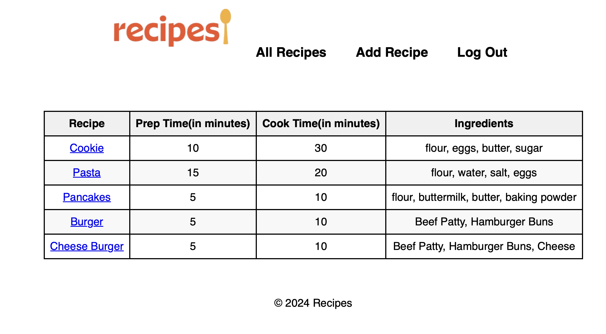

# 📖 Recipe App 🍽️

- This is a simple web application that allows users to Create and Read recipes. 
- Create, Read, Update/Edit, or Delete your own reviews.
- Users can also login using their Google account using OAuth2.

## Technologies 💻

This project is built with the following technologies:

- MongoDB: A document-based database that stores data in JSON-like format.
- Mongoose: An object data modeling (ODM) library that provides a schema-based solution to model data for MongoDB.
- Express: A web framework for Node.js that handles routing, middleware and server-side logic.
- Node.js: A runtime environment that executes JavaScript code outside the browser.
- Passport: An authentication middleware for Node.js that supports various strategies, including Google OAuth2.

## ⚡ Installation ⚡
To run this project, you need to have Node.js and MongoDB installed on your machine. 

.env file in the root directory of the project and add the following variables:
- PORT= The port number for the server
- MONGO_URI= The connection string for MongoDB
- GOOGLE_CLIENT_ID= your-google-client-id # The client ID for Google OAuth2
- GOOGLE_CLIENT_SECRET= your-google-client-secret # The client secret for Google OAuth2

  

## Getting Started
   #### 👨‍🍳 [App Link ]<https://busy-cyan-ladybug-garb.cyclic.app/>
#### 📁 [Trello Link]<https://trello.com/b/1VBqOoDp/recipes>

## Next Steps: Planned Future Enhancements
- Add a search/find function 🔍🔦
